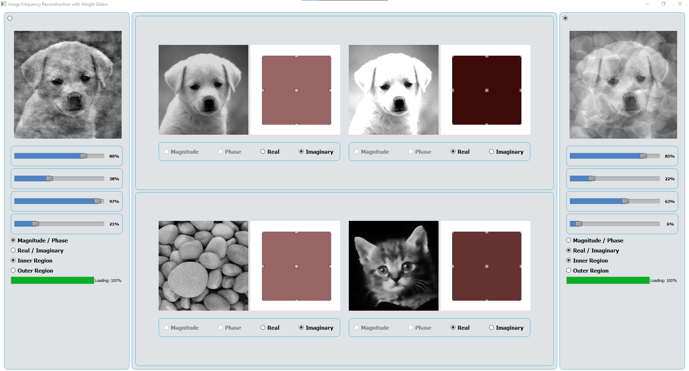

# Image-Mixer



## Overview
Image-Mixer is a PyQt5-based application that allows users to load, adjust, and mix images using various frequency components. The application provides real-time adjustments for brightness and contrast, and allows users to reconstruct images using different frequency components such as magnitude, phase, real, and imaginary parts.

## Features
- Load and display up to four images.
- Adjust brightness and contrast in real-time.
- Select and display different frequency components (magnitude, phase, real, imaginary).
- Reconstruct images using weighted combinations of frequency components.
- Support for selecting regions inside or outside the image for reconstruction.

## Requirements
- Python 3.x
- numpy
- opencv-python
- PyQt5
- matplotlib

## Installation
1. Clone the repository:
    ```sh
    git clone https://github.com/ahmed-226/Image-Mixer.git 
    ```
2. Navigate to the project directory:
    ```sh
    cd Image-Mixer
    ```
3. Install the required packages:
    ```sh
    pip install -r requirements.txt
    ```

## Usage
1. Run the application:
    ```sh
    python main.py
    ```
2. Load images by double-clicking on the image placeholders.
3. Adjust brightness and contrast by dragging the mouse over the image.
4. Select different frequency components using the radio buttons.
5. Adjust the weights of the components using the sliders.
6. View the reconstructed image in the output port.


## License
This project is licensed under the MIT License.
